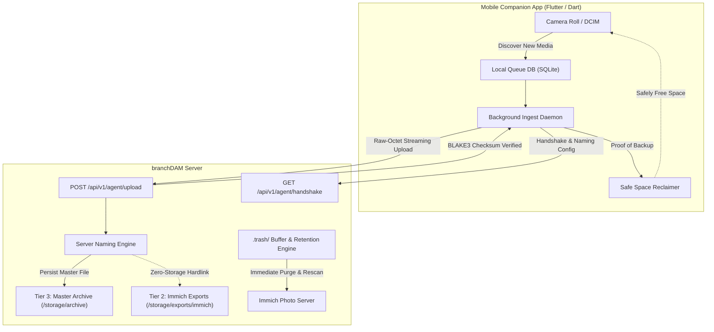

# Mobile Companion App (`branchdam-mobile`)

The [branchDAM Mobile Companion App](https://github.com/s3ntin3l8/branchdam-mobile) provides automated photo and video ingest from mobile devices (Android and iOS) directly into branchDAM's Master Archive.

---

## 1. Overview & Architecture

---

## 2. Ingest Lifecycle

1. **Local Discovery & Queueing**:
   - The background daemon detects newly captured photos and videos from device storage.
   - Files are indexed in the local SQLite queue (`queue.db`) with an initial `PENDING_UPLOAD` status.

2. **Handshake & Configuration Sync**:
   - On connection, the client calls `GET /api/v1/agent/handshake` to verify machine credentials, server version, and server-configured naming templates (`ingest.namingTemplate`).

3. **Direct-to-Archive Streaming Upload**:
   - The device streams binary payloads directly to `POST /api/v1/agent/upload` using HTTP headers:
     - `X-Filename`: original media filename (e.g. `PXL_20260829_120000.jpg`).
     - `X-Camera-Model`: device model (e.g. `Pixel 9 Pro`).
     - `X-Capture-Timestamp`: EXIF capture Unix timestamp.
     - `X-Blake3-Hash`: optional pre-computed BLAKE3 hash for end-to-end integrity.
   - The server streams bytes directly to disk in `TIER3_MASTER_ARCHIVE`, calculates BLAKE3 and fast hash in a single pass, resolves the folder structure according to the active naming template, and records the `media_nodes` row.

4. **Instant Zero-Storage Immich Display**:
   - Non-RAW displayable images and videos (`.jpg`, `.heic`, `.png`, `.webp`, `.mp4`, `.mov`) are automatically hardlinked into `TIER2_EXPORTS/immich/` under the matching folder structure.
   - A `FINAL_EXPORT` edge is registered in `media_edges`, giving instant access in Immich galleries without taking up duplicate disk space.

5. **Safe Space Reclaim**:
   - Once the server responds with `201 UPLOADED` and matching BLAKE3 hash confirmation, the local file is marked `BACKED_UP`.
   - The Safe Space engine can automatically delete local media from device storage after verified archival backup.

---

## 3. Deletion & 30-Day Trash Buffer

When a user deletes a photo or video:
- The mobile companion app enqueues an `EVENT_NODE_DELETED` agent event.
- Upon processing the event:
  1. **Instant Gallery Purge**: Any linked Immich export file is unlinked immediately, its remote sync state is purged, and an Immich library rescan is triggered so the deleted item vanishes from galleries right away.
  2. **Soft-Delete Isolation**: The master file is safely moved into `.trash/<rel_path>` inside the storage location rather than permanently unlinked.
  3. **30-Day Automated Retention**: A background pruning worker regularly scans `.trash/` across all storage locations and unlinks files older than `trash.retentionDays` (configurable via web UI settings, default: 30 days).

---

## 4. Pairing & Authentication

1. In the branchDAM web UI, navigate to **Settings** $\rightarrow$ **Machine API Keys** (or generate via CLI).
2. Open the mobile companion app and scan the QR code or enter the server URL and API key.
3. The app authenticates as `KindMachine` via `X-API-Key` or `Authorization: Bearer <key>`.
